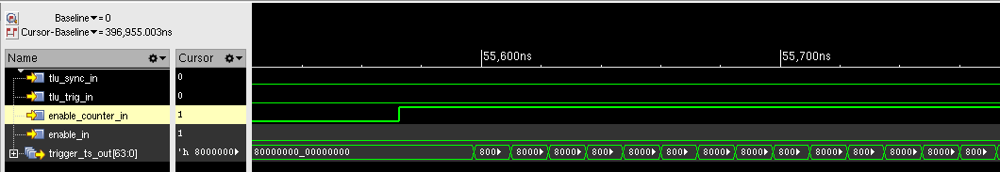
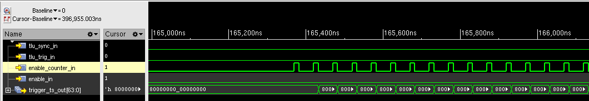
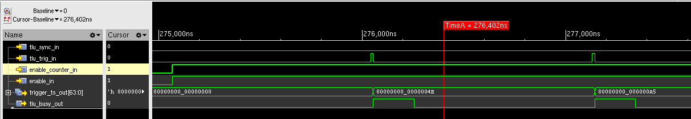
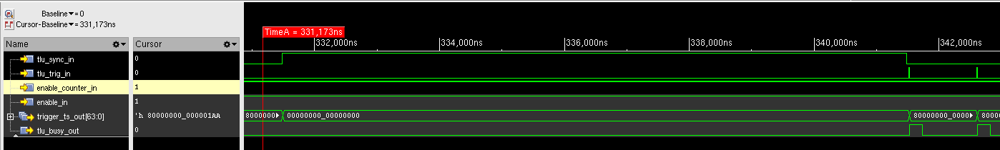
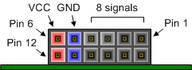

# Trigger Logic Unit (FPGA Timestamp)

The Trigger Logic Unit (TLU) support in the firmware manages two critical functionalities:

- It allows generating the FPGA core clock either from the on-board system clock or via an external 40 MHz clock, which can synchronize with systems like a triggering calorimeter.

- It provides configurable modes for appending FPGA Timestamps to astropix dataframes—whether you’re using TLU features or not.

The following sections detail how these components work.

!!! warning
    Note that the astropix sensor continues to operate as an untriggered device; trigger inputs are solely used for firmware and FPGA timestamp purposes.

## Clocking (Board or External)

The FPGAs internal timing relies on a specialized clock management primitive known as MMMC (Multi-Mode Clock Manager). This device takes two different clocks: one is the board's main 100 MHz clock signal, and the other is an external clock signal coming from your trigger logic unit at 40 MHz. Under normal circumstances, the MMMC uses the 100 MHz clock to drive all the internal processes. However, if you connect the external 40 MHz clock, the MMMC will automatically be switched to this reference so that the board's internal clocks become synchronized with the external clock.

Here’s what happens in simple terms:

• When using the default configuration (no external trigger clock), the FPGA runs on a stable 100 MHz clock provided by the board.

• If you connect an external 40 MHz clock to the designated input, MMMC reference will be switched to this external clock. The result is that all internal clocks are locked and synchronized with the external trigger logic unit’s clock.


This design ensures that when you use an external clock, the FPGA's timing (and therefore any timestamp counters) are in phase with your external trigger system. That is especially important if you want to correlate events precisely between the trigger logic and the FPGA’s internal processes.

!!! warning
    The switch between board or external clock is automatic - be aware that if you change the clock during runtime, an internal reset will be issued, so that you have to re-start any software running or reconfigure the register file.

## FPGA Timestamp

The FPGA Timestamp is added to the Data Frame wrapping an Astropix Payload, see [Layer Interface](./layer_if.md#frame-format) for details


### Timestamp configuration

The timestamp is supplied by the Trigger Logic Unit (TLU). When the TLU’s counter is enabled it increments on every core‑clock cycle. You can slow down this counting by configuring the register file’s counter divider register, which triggers the enable periodically.

When the TLU is **disabled**, its counter output simply updates with each clock tick.
When the TLU is **enabled**, the following rules apply:

* The counter output resets whenever the external input `tlu_sync` signal is asserted.
* It then updates only when an external trigger signal arrives, the counter keeps incrementing in the background.
* If no new trigger occurs, the counter output holds the last value, so all subsequent data frames receive the same timestamp.

After each trigger, the TLU asserts a busy output for a user‑configurable number of clock cycles. This blocks any new triggers from the external module during that period, ensuring that all frames produced after the trigger are stamped with the identical timestamp.

Here are some example waveforms:



/// caption
The TLU is disabled, but the counter enabled - The counter enable is always on, hence the timestamp output increments at each core clock cycle (80Mhz)
///


/// caption
The TLU is disabled, but the counter enabled periodically. The counter enable signal is asserted for one clock cycle every time the timestamp counter divider register in the register file reaches the configured match value, effectively dividing the counting speed.
///


/// caption
In this waveform, the TLU is enabled - after a reset the timestamp output is 0, then after the trigger input is asserted, the timestamp output is updated from the counter value.
The counter increments in the background until the next trigger updates the timestamp output
///


/// caption
In this example, the trigger sync signal resets the counter, and the timestamp output changes again after a trigger is asserted.
///


### Timestamp Size

The timestamp output of the TLU is 64 bits wide - however the data frames by default only output the lower 32 bits.

The configuration bits timestamp_size in register [layers_fpga_timestamp_ctrl](main_rfg.md#layers_fpga_timestamp_ctrl) can be used to modify the timestamp size in the data frames output from 16 to 64 bits.


### User python API


The FPGA timestamp functionality can be configured using three Python asynchronous methods:

- `layersConfigFPGATimestamp` – This method sets up the basic FPGA timestamp behavior. It lets you choose whether to enable the timestamp counter, use a divider (so that the count speed is reduced by dividing the core clock), and enable additional TLU (trigger logic unit) features such as asserting busy signals on specific trigger events. You can also select how many bits of timestamp data are appended to your output frames.

- `layersConfigFPGATimestampFrequency` – This method configures the frequency divider so that the FPGA’s high-speed core clock is divided down to a desired tick rate for the timestamp counter. It calculates an appropriate divider value based on the FPGA’s internal core frequency and writes it to hardware registers. (If your chosen frequency results in an impractically high divider, this function will raise an error.)

- `layersConfigTLUBusyTime` – This method sets the duration (in clock cycles) during which the TLU busy signal remains active after a trigger or synchronization event occurs. The value you provide must be within 1 and 65,535 clock cycles.

Below is a more detailed explanation with examples that show how these methods can be used in your Python code:


#### Example 1: Basic Timestamp Configuration

Suppose you want to enable the FPGA timestamp so that it counts events. You also want to use a divider (so that counting occurs at a lower frequency) and include additional TLU functionality. You might choose a 32-bit timestamp appended to your data frames, and force an immediate write of these settings by setting flush=True.

For example:

```python
  await instance.layersConfigFPGATimestamp(
   enable=True,             # Activate the FPGA timestamp
   use_divider=True,        # Enable the divider to reduce the counting speed
   use_tlu=True,            # Enable additional trigger logic unit functionality
   tlu_busy_on_t0=False,    # (Optional) Do not assert busy immediately on a sync event
   timestamp_size=1,        # Use 32 bits for the timestamp (0:16, 1:32, 2:48, 3:64)
   flush=True               # Write changes to firmware immediately
  )
```


#### Example 2: Configuring the Timestamp Divider Frequency

After setting up basic configuration in Example 1, you might want to slow down how often the timestamp counter increments. The layersConfigFPGATimestampFrequency method computes a divider based on your desired output frequency and applies it.

For instance, if your FPGA core runs at a high frequency and you’d like the timestamp to tick every second, you could do:

```python
  await instance.layersConfigFPGATimestampFrequency(targetFrequencyHz=1, flush=True)
```

This call calculates a divider value (coreFrequency / 1 Hz) and writes it into the appropriate register. If the resulting divider is too high (or too low), the function will raise an assertion error.


#### Example 3: Setting TLU Busy Duration

In some experiments, you might also need to control how long the TLU busy signal remains active after a trigger event. The layersConfigTLUBusyTime method lets you specify this duration in clock cycles (with a maximum of 65,535).

For example:

```python
  await instance.layersConfigTLUBusyTime(clockCycles=500, flush=True)
```

Here, after a trigger or sync event, the busy signal will be asserted for 500 clock cycles.


## Gecco PMOD Connector

The TLU I/O are mapped to the Nexys Video PMOD JC connector:



/// caption
///

| Pin | Signal | Note |
|----|---|---|
|1: |Trigger_P |Trigger Signal Input (LVDS25)|
| 2:| Trigger_N|Trigger Signal Input (LVDS25)|
| 3:| T0/Reset | (single-ended VCC level) |
| 4:| CONT  - not used by us |(single-ended VCC level) - NOT USED|
| 5:| GND||
| 6:| VCC|3.3V|
| 7:| Clk_P|TLU Clock  input |
| 8:| Clk_N|TLU Clock  input|
| 9:| Busy_P|Busy Output - VCC Level (not differential) |
| 10| Busy_N|Busy Output, P signal negated (not differential)|
| 11| GND ||
| 12| VCC |3.3V|

!!! warning
    The Busy signals are not true differential, P and N are negated of each other but the signal is of LVCMOS 3.3V type. The PMOD connector on Nexys can support differential inputs with external termination, but not differential outputs.
